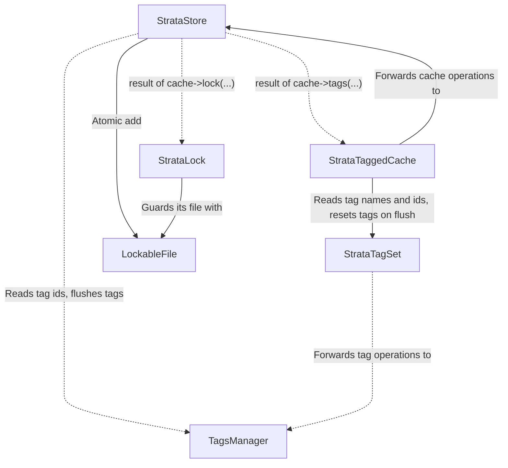

# Cache Module

This module holds the caching code of the Strata package. The main entry point is the `StrataStore` class. It is a Laravel cache driver that stores values as files on disk, and Laravel registers it under the driver name `strata`.

## Architecture

The module has four parts.

- **The store.** `StrataStore` is the cache driver. It holds the public cache API, reads and writes the value files, and creates the tagged cache when `tags(...)` is called.
- **Tagging.** `StrataTaggedCache` and `StrataTagSet` are what `tags(...)` returns. `TaggableValue` carries a value with its tags. `TagsManager` owns the tags management on disk.
- **Locks.** `StrataStore` hands out `StrataLock` objects through the `ManagesLocks` concern, and `SafeLockProvider` is the contract it implements that safely supports both Laravel 12 and 13.



## Storage

All files are under the directory set in `strata.directory` config value.

```
<directory>/
    data/
        a1/
            bb/
                a1bbc3a44f...        one file per cache key
    locks/
        a1bbc3a44f...                one file per lock
    meta/
        tags/
            <sha1 of tag name>.id    one file per tag
```

### Cached value file

The file name is the `sha1` of the key, split into two levels of directories so no directory grows too large (exactly like Laravel's default file cache).

The file has three parts, one after the other in separate lines.

```
data/a1/bb/a1bbc3a44f...  (cached value file)
+------------------------------------------------------+
| line 1       expires_at                              |
|              Unix time in seconds                    |
+------------------------------------------------------+
| line 2       tags                                    |
|              JSON object, empty line when untagged   |
|              tag name => tag id at write time        |
|                                                      |
|              books  => 3bfcc4d2-6300-4867-...        |
|              assets => b0c12303-87cb-4588-...        |
+------------------------------------------------------+
| rest         value                                   |
|              serialize($value)                       |
+------------------------------------------------------+
```

_Note: line 1 (expires_at) and line 2 (tags) are referred to as Cached Value Metadata._

### Tag file

The file name is the `sha1` of the tag name plus `.id`. Hashing avoids problems with names such as `users/en`, which would create a subdirectory.

```
meta/tags/<sha1 of tag name>.id  (tag id file)
+------------------------------------------------------+
| <uuid>|<unix time>                                   |
+------------------------------------------------------+
```

The id is compared on read with the id stored in the value file of the same tag. The time is when the id was created or last rotated, and only pruning uses it. The tag files are kept out of `data/`, so a tag flush never has to scan value files.

### Lock file

The file name is the `sha1` of the lock name, placed directly in `locks/` with no subdirectories, since there are few locks. The lock directory must differ from the cache directory, and the store refuses to be built otherwise.

```
locks/<sha1 of lock name>  (lock file)
+------------------------------------------------------+
| line 1       expires_at                              |
|              Unix time in seconds                    |
+------------------------------------------------------+
| rest         owner                                   |
|              plain text, may span many lines         |
+------------------------------------------------------+
```

A lock has no tags and is not serialized.

## Algorithms

### Lazy eviction

A read checks the expiry, then the tags, and only then unserializes the value. A file that is expired, broken, or has a flushed tag is a miss and is deleted on the spot. Nothing runs in the background, so the disk is cleaned up by the reads.

### Tag invalidation by id rotation

Drivers such as Redis put the tag ids in the cache key, and a flush changes the ids. That makes old cached values that nothing points to slowly leave the cache. This does not work on a filesystem because it will leave the file nodes dangling forever if they are not read. Strata keeps the key as is, and writes the tag ids that are current at write time into the [cached value file](#cached-value-file).

A tag is flushed by rotating its id in the [tag file](#tag-file). This will make every value stored with the old ID evicts on read. 

Strata has no index from a tag to its values, so a flush never touches value files. The `Cache::flush()` on the whole store deletes all of `data/` and empties `meta/tags`.

Tag files are never deleted just because they look unused, since Strata cannot tell if a value still points to them. The `strata:prune-stale-tags` command deletes the old ones by age.

### Concurrency

Writes overwrite a file in place, so it is briefly empty. Strata uses file locks to make that safe.

- Reads take a shared lock, so a read waits for a writes in progress.
- Writes take an exclusive lock.
- The `add` method takes a non-blocking exclusive lock, checks the entry under it, and writes only if the key is free.
- The `increment`/`decrement` methods take a single exclusive lock, read the current value, and write the new one before releasing it, so two concurrent calls on the same key can never both read the same starting value and lose one of the updates.
- A tag id is written to a temporary file that is then renamed, so a reader never sees a half written id.

### Locks

`Cache::lock()` returns a `StrataLock`, which extends the Laravel `Lock` class. It has its [own file](#lock-file), and does not share the layout of cached values.

Acquiring uses a non-blocking exclusive lock and return false when another process holds it. Releasing and refreshing uses a blocking lock. Only the owner can release or refresh a lock.

Because locks live in their own directory, `Cache::flush()` never releases them, and `flushLocks()` deletes them all.

## Differences from the Laravel's file driver

- It supports tags.
- Locks live in their own directory and their own format.
- The value file has a different format, and read incrementally. First we check the metadata, if the file is not expired and has valid tags then we continue to read its value.
- The `increment()`/`decrement()` are atomic, holding a single exclusive lock across the reads and the writes.
